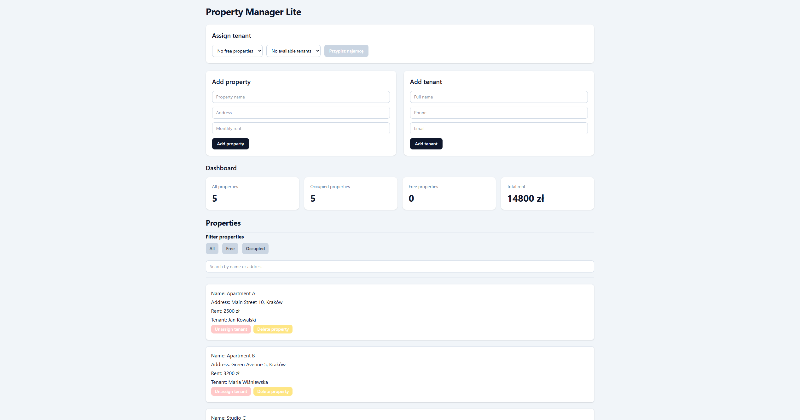

# Property Manager Lite

A small Vanilla JavaScript application for managing rental properties and tenants.

The project focuses on data relationships, DOM rendering, localStorage persistence, filtering, searching, and basic UI polish with Tailwind CSS.

## Live Demo

[View live project](https://twoj-link.github.io/property-manager-lite/](https://targonski.dev/property-manager-lite/)

## Features

* Add and delete properties
* Add and delete tenants
* Assign and unassign tenants to properties
* Prevent deleting tenants who are assigned to a property
* Show available properties and tenants dynamically
* Dashboard statistics
* Search properties by name or address
* Search tenants by name, phone, or email
* Filter properties by status: all, free, occupied
* Persist data in localStorage
* Confirmation before destructive actions
* Toast-style messages
* Tailwind CSS layout

## Technologies

* HTML
* Tailwind CSS
* Vanilla JavaScript
* localStorage

## What I learned

* DOM rendering
* State management in Vanilla JavaScript
* Data relationships between arrays
* `filter()`, `find()`, `some()`, and `reduce()`
* Form validation
* localStorage persistence
* UI polish with Tailwind CSS
* Basic project structure and Git workflow

## Screenshot

## How to run

Open `index.html` in the browser.

No build step is required.
